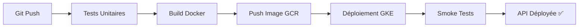

# Étape 7 : CI/CD avec Google Cloud Build

## 🎯 Objectif

Mettre en place un **pipeline CI/CD automatique** qui construit, teste et déploie l'API automatiquement à chaque modification du code.

---

## 📋 Ce que fait le Pipeline



### Détail des Étapes

| Étape | Description | Durée |
|-------|-------------|-------|
| **1. Tests Unitaires** | Vérifie que le code fonctionne | ~30s |
| **2. Build Docker** | Construit l'image de l'API | ~2-3 min |
| **3. Push GCR** | Envoie l'image sur Google Container Registry | ~30s |
| **4. Déploiement GKE** | Met à jour les pods Kubernetes | ~1 min |
| **5. Vérification** | Attend que le rollout soit terminé | ~2 min |
| **6. Smoke Tests** | Teste health, metrics, API | ~1 min |

**Durée totale** : ~7-10 minutes

---

## 🚀 Démarrage Rapide

### 1. Vérifier la Configuration

```powershell
# Lancer le script de vérification
.\verify_cloud_build_setup.ps1
```

Ce script vérifie :
- ✅ Présence de `cloudbuild.yaml`
- ✅ Structure des fichiers du projet
- ✅ Installation de gcloud CLI
- ✅ Projet GCP configuré
- ✅ Cluster GKE existant
- ✅ Repository Git

### 2. Suivre le Guide Complet

Ouvrez **[GUIDE_CLOUD_BUILD.md](./GUIDE_CLOUD_BUILD.md)** et suivez les étapes :

1. ✅ Activer les APIs Google Cloud
2. ✅ Connecter GitHub à Cloud Build
3. ✅ Créer le déclencheur (trigger)
4. ✅ Configurer les permissions
5. ✅ Tester le pipeline

### 3. Tester le Pipeline

```powershell
# Créer un commit test
git add cloudbuild.yaml GUIDE_CLOUD_BUILD.md verify_cloud_build_setup.ps1
git commit -m "feat: Ajout pipeline CI/CD avec Cloud Build"
git push origin main
```

Puis observez le build sur : https://console.cloud.google.com/cloud-build/builds

---

## 📁 Fichiers de l'Étape

```
digital-social-score/
├── cloudbuild.yaml                 # Configuration du pipeline CI/CD
├── GUIDE_CLOUD_BUILD.md            # Guide détaillé étape par étape
├── verify_cloud_build_setup.ps1    # Script de vérification
└── etape7-cloud-build/
    └── README.md                   # Ce fichier
```

---

## 🔧 Configuration du Pipeline

### Structure du cloudbuild.yaml

```yaml
steps:
  # 1. Tests
  - name: python:3.10-slim
    args: ['pytest', 'etape3-api/tests/']
  
  # 2. Build
  - name: gcr.io/cloud-builders/docker
    args: ['build', '-t', 'gcr.io/$PROJECT_ID/dss-api:$SHORT_SHA']
  
  # 3. Push
  - name: gcr.io/cloud-builders/docker
    args: ['push', 'gcr.io/$PROJECT_ID/dss-api:$SHORT_SHA']
  
  # 4. Deploy
  - name: gcr.io/cloud-builders/kubectl
    args: ['set', 'image', 'deployment/dss-api', '...']
  
  # 5. Verify
  - name: gcr.io/cloud-builders/kubectl
    args: ['rollout', 'status', 'deployment/dss-api']
  
  # 6. Smoke Tests
  - name: curlimages/curl
    args: ['curl', '-f', 'http://34.38.214.124/health']
```

### Variables Disponibles

| Variable | Description | Exemple |
|----------|-------------|---------|
| `$PROJECT_ID` | ID du projet GCP | `digitalsocialscoreapi` |
| `$SHORT_SHA` | Hash court du commit | `abc1234` |
| `$BRANCH_NAME` | Nom de la branche | `main` |
| `$COMMIT_SHA` | Hash complet du commit | `abc123...` |

---

## 🎓 Avantages du CI/CD

### ✅ Pour le Développement

- **Détection précoce des bugs** : Tests automatiques à chaque commit
- **Déploiements rapides** : Plus besoin de déployer manuellement
- **Historique complet** : Chaque build est tracé et reproductible
- **Rollback facile** : Revenir à une version précédente en 1 clic

### ✅ Pour la Production

- **Zero-downtime** : Déploiement sans interruption de service
- **Smoke tests** : Vérification automatique après déploiement
- **Traçabilité** : Savoir quelle version est en production
- **Reproductibilité** : Le même code produit toujours le même résultat

### ✅ Pour l'Équipe

- **Collaboration** : Tout le monde peut déployer en sécurité
- **Documentation** : Le pipeline documente le processus
- **Confiance** : Les tests garantissent la qualité
- **Productivité** : Plus de temps pour développer, moins pour déployer

---

## 📊 Monitoring des Builds

### Console Cloud Build

- **Historique** : https://console.cloud.google.com/cloud-build/builds
- **Triggers** : https://console.cloud.google.com/cloud-build/triggers
- **Settings** : https://console.cloud.google.com/cloud-build/settings

### Commandes CLI

```bash
# Lister les 5 derniers builds
gcloud builds list --limit=5

# Voir les logs d'un build spécifique
gcloud builds log <BUILD_ID>

# Lister les triggers
gcloud builds triggers list

# Déclencher manuellement un build
gcloud builds submit --config=cloudbuild.yaml .
```

---

## 🐛 Dépannage

### Le build échoue à l'étape "Tests"

**Solution** : Testez en local d'abord
```powershell
cd etape3-api
pytest tests/test_api.py -v
```

### Le build échoue à l'étape "Deploy"

**Cause** : Permissions manquantes

**Solution** :
```bash
PROJECT_NUMBER=$(gcloud projects describe digitalsocialscoreapi --format="value(projectNumber)")
gcloud projects add-iam-policy-binding digitalsocialscoreapi \
    --member="serviceAccount:${PROJECT_NUMBER}@cloudbuild.gserviceaccount.com" \
    --role="roles/container.developer"
```

### Les smoke tests échouent

**Cause** : L'IP a changé ou le service n'est pas prêt

**Solution** : Vérifiez l'IP externe
```bash
kubectl get service dss-api-service -n dss
```

Puis mettez à jour `cloudbuild.yaml` ligne 107.

---

## 🎯 Prochaines Étapes (MLOps)

Une fois le CI/CD en place, vous pouvez ajouter :

### 1. Tests de Régression du Modèle

```yaml
- name: 'python:3.10-slim'
  id: 'test-model-accuracy'
  args:
    - 'pytest'
    - 'etape2-modele-ia/tests/test_model_regression.py'
```

### 2. Scan de Sécurité

```yaml
- name: 'gcr.io/cloud-builders/gcloud'
  id: 'vulnerability-scan'
  args:
    - 'container'
    - 'images'
    - 'scan'
    - 'gcr.io/$PROJECT_ID/dss-api:$SHORT_SHA'
```

### 3. Tests de Charge Automatiques

```yaml
- name: 'locustio/locust'
  id: 'load-tests'
  args:
    - '-f'
    - 'etape5-load-testing/locustfile.py'
    - '--headless'
    - '--users'
    - '50'
    - '--run-time'
    - '2m'
```

### 4. Notifications Slack/Email

```yaml
- name: 'gcr.io/cloud-builders/gcloud'
  id: 'notify-success'
  args:
    - 'pubsub'
    - 'topics'
    - 'publish'
    - 'build-notifications'
    - '--message'
    - 'Build $BUILD_ID succeeded'
```

---

## 📖 Ressources

### Documentation Officielle

- [Cloud Build Overview](https://cloud.google.com/build/docs/overview)
- [Deploying to GKE](https://cloud.google.com/build/docs/deploying-builds/deploy-gke)
- [Build Configuration](https://cloud.google.com/build/docs/build-config-file-schema)
- [Build Triggers](https://cloud.google.com/build/docs/automating-builds/create-manage-triggers)

### Exemples

- [Cloud Build Samples](https://github.com/GoogleCloudPlatform/cloud-build-samples)
- [Multi-stage Builds](https://cloud.google.com/build/docs/optimize-builds/docker-best-practices)
- [Parallel Steps](https://cloud.google.com/build/docs/configuring-builds/create-basic-configuration#parallel-builds)

### Vidéos

- [Cloud Build Quickstart](https://www.youtube.com/watch?v=AALeWR2_7Mg)
- [CI/CD with GKE](https://www.youtube.com/watch?v=w3WNwRPMXQ0)

---

## ✅ Checklist de Validation

- [ ] `cloudbuild.yaml` créé à la racine du projet
- [ ] APIs Cloud Build et Container Registry activées
- [ ] Repository GitHub connecté à Cloud Build
- [ ] Déclencheur créé et configuré
- [ ] Permissions du compte de service configurées
- [ ] Premier build réussi (6 étapes en vert)
- [ ] L'API est accessible après le déploiement
- [ ] Les smoke tests passent
- [ ] Le pipeline se déclenche automatiquement au push

---

## 🎓 Points Clés à Retenir

1. **Automatisation complète** : De git push au déploiement en production
2. **Tests intégrés** : Tests unitaires + smoke tests automatiques
3. **Zero-downtime** : Déploiement progressif sans interruption
4. **Traçabilité** : Chaque build est versionné et tracé
5. **Sécurité** : Les tests bloquent les déploiements défectueux

---

**Date de création** : 07/11/2025  
**Version** : 1.0  
**Status** : ✅ Prêt pour la production
