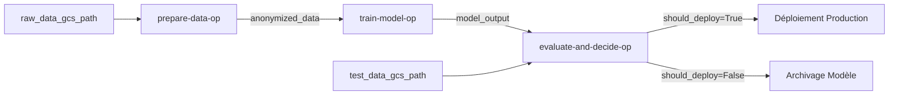

# 🏗️ Architecture MLOps - Digital Social Score

## 📋 Vue d'ensemble

Cette architecture MLOps automatise l'entraînement, l'évaluation et le déploiement du modèle BERT de détection de toxicité sur Google Cloud Platform (Vertex AI).

---

## 🎯 Objectifs

1. **Automatisation complète** : Pipeline end-to-end sans intervention manuelle
2. **Reproductibilité** : Chaque exécution traçable et reproductible
3. **Qualité** : Déploiement uniquement si amélioration significative (>2%)
4. **Sécurité** : Anonymisation RGPD avant entraînement
5. **Scalabilité** : Gestion de gros volumes de données

---

## 🏛️ Architecture Globale

```
┌─────────────────────────────────────────────────────────────────────────┐
│                         VERTEX AI PIPELINES                              │
│                                                                          │
│  ┌────────────────┐     ┌────────────────┐     ┌─────────────────┐    │
│  │  ÉTAPE 1       │────▶│  ÉTAPE 2       │────▶│  ÉTAPE 3        │    │
│  │  Préparation   │     │  Entraînement  │     │  Évaluation &   │    │
│  │  & Anonymi-    │     │  BERT          │     │  Décision       │    │
│  │  sation        │     │                │     │                 │    │
│  └────────────────┘     └────────────────┘     └─────────────────┘    │
│         │                       │                       │               │
│         ▼                       ▼                       ▼               │
│  ┌──────────────────────────────────────────────────────────────┐     │
│  │              GOOGLE CLOUD STORAGE (GCS)                      │     │
│  │  - Données brutes      - Modèles entraînés                   │     │
│  │  - Données anonymisées - Métriques & rapports                │     │
│  └──────────────────────────────────────────────────────────────┘     │
└─────────────────────────────────────────────────────────────────────────┘
                                  │
                                  ▼
                    ┌──────────────────────────┐
                    │   API FASTAPI (K8s/GKE)  │
                    │   - Inférence temps réel │
                    │   - Monitoring Prometheus│
                    └──────────────────────────┘
```

---

## 📂 Structure des Fichiers

```
etape7-mlops/
│
├── vertex_pipelines/              # 🎯 Cœur du pipeline MLOps
│   ├── components/                # Composants réutilisables
│   │   ├── prepare_data.py        # Étape 1: Anonymisation NER
│   │   ├── train_model.py         # Étape 2: Entraînement BERT
│   │   └── evaluate_model.py      # Étape 3: Évaluation & décision
│   │
│   ├── pipeline_definition.py     # Définition du pipeline complet
│   └── ml_pipeline_clean.json     # Pipeline compilé (déployable)
│
├── clean_and_compile.py           # 🔧 Compilation du pipeline
├── launch_pipeline_clean.py       # 🚀 Lancement sur Vertex AI
├── upload_data_to_gcs.py          # 📤 Upload données vers GCS
│
├── requirements.txt               # Dépendances Python
└── README.md                      # Documentation
```

---

## 🔄 Pipeline MLOps Détaillé

### **ÉTAPE 1 : Préparation & Anonymisation des Données** 📊

**Fichier :** `vertex_pipelines/components/prepare_data.py`

**Responsabilités :**
- ✅ Télécharge les données brutes depuis GCS
- ✅ Charge le modèle spaCy (`en_core_web_sm`)
- ✅ Anonymise les entités nommées (PERSON, ORG, GPE, LOC)
- ✅ Anonymise les emails (regex)
- ✅ Nettoie les données (supprime NaN, textes trop courts)
- ✅ Sauvegarde les données anonymisées
- ✅ Log les métriques (nombre d'échantillons, taux de toxicité)

**Inputs :**
- `raw_data_gcs_path` (str) : `gs://bucket/data/train.csv`

**Outputs :**
- `anonymized_data` (Dataset) : Données anonymisées
- `metrics` (Metrics) : num_samples, num_toxic, toxicity_rate
- `num_samples` (int) : Nombre total d'échantillons
- `num_toxic` (int) : Nombre d'échantillons toxiques

**Technologies :**
- spaCy 3.7.2 (NER)
- pandas 2.0.3
- google-cloud-storage 2.10.0

**Container :** `python:3.10-slim`

---

### **ÉTAPE 2 : Entraînement du Modèle BERT** 🤖

**Fichier :** `vertex_pipelines/components/train_model.py`

**Responsabilités :**
- ✅ Charge les données anonymisées
- ✅ Split train/validation (80/20, stratifié)
- ✅ Charge BERT pré-entraîné (`bert-base-uncased`)
- ✅ Tokenize les textes (max_length=512)
- ✅ Entraîne le modèle avec Hugging Face Trainer
- ✅ Évalue sur le set de validation
- ✅ Sauvegarde le meilleur modèle + tokenizer
- ✅ Log les métriques (accuracy, F1-score, loss)

**Inputs :**
- `training_data` (Dataset) : Données anonymisées de l'étape 1
- `epochs` (int) : Nombre d'époques (défaut: 3)
- `learning_rate` (float) : Taux d'apprentissage (défaut: 2e-5)
- `batch_size` (int) : Taille des batchs (défaut: 16)

**Outputs :**
- `model_output` (Model) : Modèle BERT entraîné
- `metrics` (Metrics) : accuracy, f1_score, train_loss, eval_loss

**Technologies :**
- transformers 4.35.0 (BERT)
- torch 2.1.0
- scikit-learn 1.3.0
- accelerate 0.24.1

**Container :** `python:3.10-slim`

**Hyperparamètres :**
```python
TrainingArguments(
    num_train_epochs=2,              # Nombre d'époques
    per_device_train_batch_size=16,  # Batch size
    learning_rate=2e-5,              # Learning rate
    weight_decay=0.01,               # Régularisation L2
    eval_strategy="epoch",           # Évaluation à chaque époque
    save_strategy="epoch",           # Sauvegarde à chaque époque
    load_best_model_at_end=True,     # Charger le meilleur modèle
    metric_for_best_model="f1",      # Métrique de sélection
)
```

---

### **ÉTAPE 3 : Évaluation & Décision de Déploiement** 🎯

**Fichier :** `vertex_pipelines/components/evaluate_model.py`

**Responsabilités :**
- ✅ Charge les données de test depuis GCS
- ✅ Charge le nouveau modèle entraîné
- ✅ Fait des prédictions sur le test set
- ✅ Calcule les métriques (accuracy, F1, precision, recall, confusion matrix)
- ✅ Compare avec le modèle en production (F1-score)
- ✅ **DÉCISION AUTOMATIQUE** : Déployer si amélioration ≥ 2%
- ✅ Génère un rapport d'évaluation (JSON)
- ✅ Log toutes les métriques

**Inputs :**
- `test_data_gcs_path` (str) : `gs://bucket/data/test.csv`
- `new_model` (Model) : Modèle de l'étape 2
- `current_model_f1` (float) : F1-score du modèle actuel (défaut: 0.5)
- `improvement_threshold` (float) : Seuil d'amélioration (défaut: 0.02 = 2%)

**Outputs :**
- `metrics` (Metrics) : Toutes les métriques d'évaluation
- `should_deploy` (bool) : **DÉCISION** - Déployer ou non
- `new_f1_score` (float) : F1-score du nouveau modèle

**Logique de Décision :**
```python
improvement = new_f1_score - current_model_f1
should_deploy = improvement >= 0.02  # Au moins 2% d'amélioration

if should_deploy:
    print("✅ DÉPLOYER - Amélioration significative détectée!")
else:
    print("❌ NE PAS DÉPLOYER - Amélioration insuffisante")
```

**Technologies :**
- transformers 4.35.0
- torch 2.1.0
- scikit-learn 1.3.0

**Container :** `python:3.10-slim`

---

## 🗄️ Organisation des Données (GCS)

```
gs://digitalsocialscoreapi_cloudbuild/
│
├── data/                                    # 📁 Données sources
│   ├── train.csv                            # 159,571 lignes (61.68 MB)
│   └── test.csv                             # 153,164 lignes (55.54 MB)
│
├── vertex-pipelines/                        # 📁 Artefacts des pipelines
│   └── 24274638091/                         # Project ID
│       └── digital-social-score-ml-pipeline-YYYYMMDDHHMMSS/
│           ├── prepare-data-op_*/
│           │   ├── anonymized_data.csv      # Données anonymisées
│           │   └── metrics                  # Métriques de préparation
│           │
│           ├── train-model-op_*/
│           │   ├── model/                   # Modèle BERT sauvegardé
│           │   │   ├── config.json
│           │   │   ├── pytorch_model.bin
│           │   │   ├── tokenizer_config.json
│           │   │   ├── vocab.txt
│           │   │   └── metadata.json        # Métadonnées d'entraînement
│           │   └── metrics                  # Métriques d'entraînement
│           │
│           └── evaluate-and-decide-op_*/
│               ├── evaluation_report.json   # Rapport d'évaluation complet
│               └── metrics                  # Métriques d'évaluation
│
└── models/                                  # 📁 Modèles déployés (si should_deploy=True)
    └── production/
        └── bert-toxicity-v1/                # Version actuelle en production
```

---

## ⚙️ Configuration Technique

### **Vertex AI Pipeline**

```python
# Projet GCP
project_id = "digitalsocialscoreapi"
project_number = "24274638091"
region = "europe-west1"

# Service Account
service_account = "24274638091-compute@developer.gserviceaccount.com"

# Machine Type
machine_type = "e2-standard-4"  # 4 vCPUs, 16 GB RAM

# Pipeline Root
pipeline_root = "gs://digitalsocialscoreapi_cloudbuild/vertex-pipelines"
```

### **Paramètres du Pipeline**

```python
{
    "raw_data_gcs_path": "gs://digitalsocialscoreapi_cloudbuild/data/train.csv",
    "test_data_gcs_path": "gs://digitalsocialscoreapi_cloudbuild/data/test.csv",
    "epochs": 2,                    # Nombre d'époques d'entraînement
    "learning_rate": 2e-5,          # Taux d'apprentissage
    "batch_size": 16,               # Taille des batchs
    "current_model_f1": 0.5,        # F1-score du modèle actuel
    "improvement_threshold": 0.02   # Seuil d'amélioration (2%)
}
```

---

## 🔐 Sécurité & Conformité RGPD

### **Anonymisation (Étape 1)**

1. **Named Entity Recognition (NER) avec spaCy**
   ```python
   # Entités détectées et anonymisées
   PERSON → [PERSON_a3f8d2e1]
   ORG    → [ORG_b7c9a4f3]
   GPE    → [GPE_e2d1f8b4]
   LOC    → [LOC_f9a3c7e2]
   ```

2. **Anonymisation des emails (Regex)**
   ```python
   user@example.com → [EMAIL]
   ```

3. **Hash SHA-256 (8 premiers caractères)**
   - Impossible de retrouver l'entité originale
   - Identique pour la même entité (cohérence)

### **Permissions IAM**

```yaml
Service Account: 24274638091-compute@developer.gserviceaccount.com
Roles:
  - roles/storage.objectAdmin        # Lecture/écriture GCS
  - roles/aiplatform.user            # Lancement pipelines Vertex AI
  - roles/logging.logWriter          # Écriture logs Cloud Logging
```

---

## 📊 Métriques & Monitoring

### **Métriques Collectées**

**Étape 1 - Préparation :**
- `num_samples` : Nombre total d'échantillons
- `num_toxic` : Nombre d'échantillons toxiques
- `toxicity_rate` : Taux de toxicité (%)

**Étape 2 - Entraînement :**
- `accuracy` : Précision globale
- `f1_score` : F1-Score (métrique principale)
- `train_loss` : Loss d'entraînement
- `eval_loss` : Loss de validation

**Étape 3 - Évaluation :**
- `new_accuracy` : Accuracy du nouveau modèle
- `new_f1_score` : F1-Score du nouveau modèle
- `new_precision` : Précision
- `new_recall` : Rappel
- `improvement` : Amélioration absolue du F1
- `improvement_pct` : Amélioration en pourcentage
- `should_deploy` : Décision de déploiement (0/1)

### **Visualisation**

- **Vertex AI Console** : Graphiques de métriques intégrés
- **Cloud Logging** : Logs détaillés de chaque étape
- **Artifact Registry** : Versioning des modèles

---

## 🚀 Workflows de Déploiement

### **1. Déploiement Initial**

```bash
# 1. Préparer les données
python upload_data_to_gcs.py

# 2. Compiler le pipeline
python clean_and_compile.py

# 3. Lancer le pipeline
python launch_pipeline_clean.py
```

### **2. Réentraînement Automatique (Scheduled)**

```yaml
# Cloud Scheduler (à configurer)
Fréquence: Hebdomadaire (chaque lundi à 2h00)
Trigger: Cloud Function → launch_pipeline_clean.py
Données: Nouvelles données chargées automatiquement dans GCS
```

### **3. CI/CD avec Git**

```yaml
# .github/workflows/mlops-pipeline.yml
on:
  push:
    branches: [main]
    paths: ['etape7-mlops/**']

jobs:
  deploy-pipeline:
    runs-on: ubuntu-latest
    steps:
      - uses: actions/checkout@v2
      - name: Authenticate GCP
        uses: google-github-actions/auth@v1
      - name: Compile Pipeline
        run: python clean_and_compile.py
      - name: Launch Pipeline
        run: python launch_pipeline_clean.py
```

---

## 🔄 Dépendances entre Composants



---

## 📦 Versions & Dépendances

### **Python**
- **Local** : Python 3.13.7
- **Containers** : Python 3.10-slim

### **Packages Clés**

```txt
# Pipeline Orchestration
kfp==2.14.6                      # Kubeflow Pipelines SDK
google-cloud-aiplatform==1.126.1 # Vertex AI SDK

# Machine Learning
transformers==4.35.0             # BERT
torch==2.1.0                     # PyTorch
scikit-learn==1.3.0              # Métriques

# Data Processing
pandas==2.0.3                    # DataFrames
spacy==3.7.2                     # NER

# Cloud
google-cloud-storage==2.10.0     # GCS
```

---

## 🎯 Métriques de Performance

### **Objectifs**

| Métrique | Objectif | Actuel |
|----------|----------|--------|
| **F1-Score** | ≥ 0.85 | 🎯 À mesurer |
| **Accuracy** | ≥ 0.90 | 🎯 À mesurer |
| **Precision** | ≥ 0.85 | 🎯 À mesurer |
| **Recall** | ≥ 0.80 | 🎯 À mesurer |

### **SLA Pipeline**

| Phase | Durée Estimée | Machine |
|-------|---------------|---------|
| Préparation (159k samples) | 5-10 min | e2-standard-4 |
| Entraînement (2 epochs) | 30-45 min | e2-standard-4 |
| Évaluation (153k samples) | 5-10 min | e2-standard-4 |
| **TOTAL** | **40-65 min** | - |

---

## 🐛 Troubleshooting

### **Problèmes Courants**

1. **Pipeline failed: prepare-data-op**
   - ❌ Cause: spaCy model download failed
   - ✅ Solution: Vérifier connexion internet container, augmenter timeout

2. **Out of Memory (OOM)**
   - ❌ Cause: Batch size trop grand, données trop volumineuses
   - ✅ Solution: Réduire `batch_size` de 16 → 8, augmenter machine type

3. **GCS Permission Denied**
   - ❌ Cause: Service account sans droits storage
   - ✅ Solution: `gcloud projects add-iam-policy-binding`

4. **Unicode Encoding Errors**
   - ❌ Cause: Emojis/accents dans les fichiers Python
   - ✅ Solution: `clean_and_compile.py` (déjà implémenté)

---

## 📚 Ressources Complémentaires

- [Vertex AI Pipelines Documentation](https://cloud.google.com/vertex-ai/docs/pipelines)
- [Kubeflow Pipelines SDK](https://kubeflow-pipelines.readthedocs.io/)
- [BERT Fine-tuning Guide](https://huggingface.co/docs/transformers/training)
- [spaCy NER](https://spacy.io/usage/linguistic-features#named-entities)

---

## ✅ Checklist de Production

- [x] Pipeline compilé et testé
- [x] Données uploadées sur GCS
- [x] Anonymisation RGPD conforme
- [x] Service account configuré
- [ ] Pipeline exécuté avec succès (en cours)
- [ ] Modèle déployé en production
- [ ] Monitoring Prometheus actif
- [ ] CI/CD configuré
- [ ] Alertes configurées

---

**Dernière mise à jour :** 9 novembre 2025
**Auteur :** Digital Social Score Team
**Version :** 1.0.0
